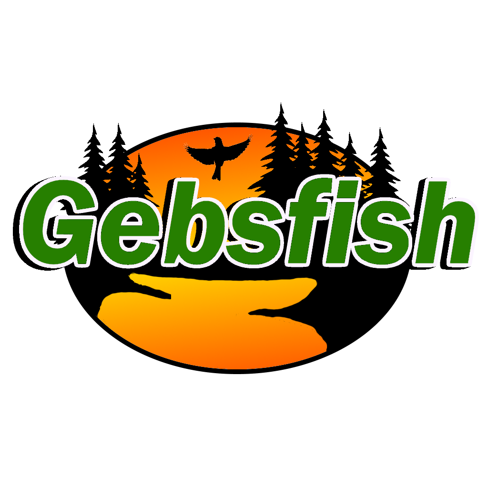

<h1 align="center">
  <br>
  
  <br>
  <a href="https://discord.gg/G8uSGZ8yyf" style="width:250"></a>
  <br>
</h1>

<h3 align="center">The Ultimate Fishing Expansion for DayZ</h3>

<p align="center">
  
  
  
</p>

<p align="center">
  <a href="#key-features">Key Features</a> •
  <a href="#configuration-examples">Configuration Examples</a> •
  <a href="#credits">Credits</a> •
  <a href="#license">License & Terms</a> •
  <a href='CHANGELOG.md'>Change Log</a>
</p>

<!--  -->

## Information

Gebsfish completely overhauls DayZ’s fishing system into a deep, rewarding, and fully customizable experience.
Built from the ground up for modded servers, it adds dozens of new fish species, dynamic environmental systems, and powerful configuration tools for server owners. 

## Key Features

* Brings the total catchable underwater creatures to 59.
* New tools, bait, storage containers, and clothing.
* Fully featured logging system for dialing in your configs to your servers needs.
* Extensive config system allows complete customizabiility to fit your server:
  - Full configuration of fish (water, rarity, type of fishing, meat yield).
  - Full configuration of junk (rarity, item).
  - Full configuration of the predator spawn system.
* Fully compatible with custom maps; If you have issues with the map you use working, make a ticket and we will issue a hotfix for that map if needed.
* Extensive config system allows complete customizabiility to fit your server:
  - English
  - Czech
  - German
  - Russian
  - Polish
  - Hungarian
  - Italian
  - Spanish
  - French
  - Chinese (Traditional and Simplified)
  - Japanese
  - Portugese
  > **Note**
  > Although supported languages are listed above, we cannot verify complete accuracy. If you are a native speaker and notice anything wrong, please reach out to us in the discord via a ticket to assist us in getting proper translations. 


## Configuration Examples

All configuration options are located in the Gebs folder located in your servers profiles folder. Some example from the configs are below. 

Fish:

```json
"Mackerel": {
        "EnvironmentInfo": "1 - pond, 2 - sea, 3 - both",
        "Environment": 2,
        "CatchMethodInfo": "1 - rod, 2 - largetrap, 3 - rod and largetrap, 4 - smalltrap, 5 - rod and smalltrap, 6 - largetrap and smalltrap, 7 - rod, largetrap and smalltrap",
        "CatchMethod": 3,
        "MeatInfo": "MeatMin and MeatMax determine the minimum and maximum meat pieces for the fillet action. DayZ has a hard limit of 10 fillets max.",
        "MeatMin": 1,
        "MeatMax": 2,
        "CatchProbInfo": "0-25; 0 means no chance to catch fish, 25 means high chance",
        "CatchProbability": 15
    },
```

## Credits

- Lothsun for features, updates, and helping the direction of this mod! 
- My close friends for motivation during this project
- TunaBomber for helping update community files and supplying the excel sheet for traders
- NekoSensei and iiiii42 for helping with initial translation support
- Doriiiiija and Echo4343 for help with community files
- Gramps#4914 for code compatibility help in the early days of the mod 
- DannyDoomno1 for help with the proper way to send config data to the client from the server
- NekoSensei and the team/players at the Le Murmure des Sans-Ames Server
- The DayZ community for reporting bugs and inspiration throughout the life of the mod
- [CadNav](https://cadnav.com) for models and textures of fish.
- [All About the Birds & Macaulay Library](https://www.allaboutbirds.org/guide/Common_Loon/sounds) For the loon call recording used in the mod.


## Support

If you like this project and think it has improved your server in any way, consider contributing! We are always looking for help with ideas, new models, and any monetary support that can help improve the mod. Open a ticket in the discord to discuss how you can contribute. 


<!-- ## You may also like...

- Future Use -->

## License

[Attribution-NonCommercial-NoDerivatives 4.0 International](https://github.com/PackJC/gebsfish/blob/master/LICENSE)

## Usage & Terms
This item is NOT authorized (strictly forbidden) for any of these conditions:
- posting on Steam, except under the Steam account Cole.
- hosting on any download server other than gebsfish current workshop download.
- hosting on any launcher for distribution other than gebsfish  current workshop download.
- to be packaged in any form other than gebsfish current workshop download.
- to create derivative works.

## PERMISSION IS NOT GRANTED FOR THIS MOD TO BE INCLUDED IN A "SERVER PACK" or "MOD PACK" DO NOT EVEN ASK TO REPACK. NO. NOT ALLOWED.
Use a Collection if you want to include this mod on your server for your users. 

## Monetization
You are hereby given monetization approval under the conditions that you follow the DayZ Server Monetization agreement and have obtained permission from Bohemia. Read more here https://www.bohemia.net/monetization

### Copyright © Smoky Mountain Software 2022-2025