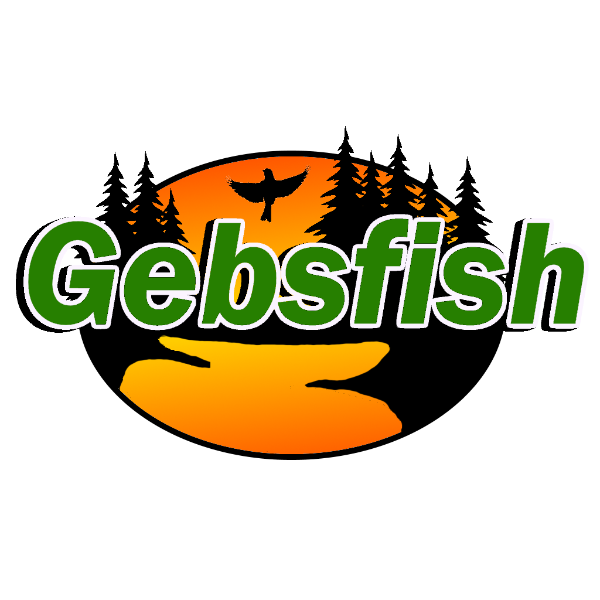

<h1 align="center">
  <br>
  
  <br>
  <a href="https://discord.gg/G8uSGZ8yyf" style="width:250"></a>
  <br>
</h1>

<h3 align="center">The Ultimate Fishing Expansion for DayZ</h3>

<p align="center">
  
  
  
</p>

<p align="center">
  <a href="#key-features">Key Features</a> •
  <a href="#advanced-systems">Advanced Systems</a> •
  <a href="#configuration-examples">Configuration Examples</a> •
  <a href="#credits">Credits</a> •
  <a href="#license">License & Terms</a> •
  <a href='CHANGELOG.md'>Change Log</a>
</p>

<!--  -->

## Information

Gebsfish completely overhauls DayZ's fishing system into a deep, rewarding, and fully customizable experience.
Built from the ground up for modded servers, it adds dozens of new fish species, dynamic environmental systems, and powerful configuration tools for server owners.

## Key Features

* **79 catchable yields** including fish, crustaceans, marine invertebrates, and amphibians.
* New tools, baits, lures, jigs, storage containers, and clothing.
* Fully featured logging system for dialing in your configs to your server's needs.
* Extensive config system allows complete customizability to fit your server:
  - Full configuration of fish (water type, rarity, fishing method, meat yield, behavior).
  - Full configuration of junk (rarity, item).
  - Full configuration of the predator spawn system (chance, classnames, spawn radius, warning sound, chat message).
  - Master enable toggles for every major catch-modifying system so you can run as much or as little of the mod as you want without losing your tuned values.
* Fully compatible with custom maps; if you have issues with the map you use working, make a ticket and we will issue a hotfix for that map if needed.
* Supported languages:
  - English
  - Czech
  - German
  - Russian
  - Polish
  - Hungarian
  - Italian
  - Spanish
  - French
  - Chinese (Traditional and Simplified)
  - Japanese
  - Portuguese
  > **Note**
  > Although supported languages are listed above, we cannot verify complete accuracy. If you are a native speaker and notice anything wrong, please reach out to us in the Discord via a ticket to assist us in getting proper translations.

## Advanced Systems

Gebsfish layers several configurable environmental systems on top of vanilla fishing. Each one can be toggled independently from the `$profile:Gebs/` config files — global toggles live in `general.json`, per-fish tuning in `fish.json`, and the bait matrix in `bait.json`.

* **Per-fish weather and time-of-day behavior** — every species has its own Rain, Storm, Dawn, Day, Dusk, and Night multipliers. Bass quiet down at dawn, walleye and catfish wake up at night, trout chase the rain. Global multipliers stack with per-fish overrides and are capped by `MaxStackedMultiplier` so a stormy night never compounds into a runaway buff.

* **Moon phase system** — accurate synodic moon-phase calculation (Meeus algorithm) from the in-game date drives a small night-only catch buff. Full-moon nights bite up to **+20%**, new-moon nights up to **-10%**. Independent toggle in config; runs even if the rain/time-of-day buffs are disabled.

* **Water temperature simulation** — each species has `TempOptimal`, `TempMin`, and `TempMax` fields (in degrees Celsius). Bass and sunfish dominate hot summer days, trout and salmon take over in cold weather, tropical species stay active year-round in warm saltwater. A `WaterTempOffset` admin knob shifts the whole curve globally for cold-themed maps (e.g. Sakhal: `-5`, frozen lake roleplay: `-10`) or tropical mods (`+5`) without editing every fish.

* **Bite-speed cycle scaling** — every fish has a 24-hour `BiteSpeed` array tuned to its real-world circadian pattern. The catching system aggregates this across the active fish pool to drive how long you wait between bites, weighted by per-fish abundance and the current time-of-day multiplier. Catfish bite slow at noon; muskie bite slow at midnight.

* **Per-bait fish preference matrix** — 20+ baits and lures each carry a per-fish multiplier table. Worms catch bluegill 2× more readily than bass and ignore large saltwater fish. Spinnerbaits attract bass, spoons attract pike, shrimp attract reef fish. Roughly 1,800 bait/fish pairings — all overridable in JSON.

* **Bamboo fishing net** — craftable, repairable net with cargo storage. Catches minnows, frogs, salamanders, or shrimp depending on water environment. Configurable spawn table with per-environment filtering (pond vs. sea) and an independent find-chance roll.

* **Predator spawn system** — configurable predators spawn around the player when fishing, gutting a fish, missing a catch, or using the bamboo net. Each action has its own chance value so you can keep predators on for fishing without applying them to filleting. Land-only spawn search — no underwater wolves. Per-predator `MinCount`, `MaxCount`, `MinRadius`, and `MaxRadius`. Optional warning sound RPC to nearby players and configurable chat-message broadcast with color options.

* **Geb fish knife buffs** — modded fish knives carry **+54% durability** (200 HP vs vanilla `HuntingKnife`'s 130) and fillet fish **10% faster** than vanilla. Speed bonus is configurable via `FishKnifeSpeedMultiplier`; durability sits between `KitchenKnife` and `KukriKnife` so it feels like a premium tool without dominating.

* **Trader compatibility** — fish quality defaults to `1.0` so popular trader mods (DayZ-Expansion-Market, TraderPlus, Dr. Jones, etc.) accept them at full value out of the box. Configurable if your trader scales by quality.

## Configuration Examples

All configuration options are located in the `Gebs` folder inside your server's profile folder. A few examples below.

**Fish entry — full set of modern fields:**

```json
"Mackerel": {
    "TempOptimal": 18.0,
    "TempMin": 8.0,
    "TempMax": 24.0,
    "EnvironmentInfo": "1 - pond, 2 - sea, 3 - both",
    "Environment": 2,
    "CatchMethodInfo": "1 - rod, 2 - largetrap, 3 - rod and largetrap, 4 - smalltrap, 5 - rod and smalltrap, 6 - largetrap and smalltrap, 7 - rod, largetrap and smalltrap",
    "CatchMethod": 3,
    "MeatInfo": "MeatMin and MeatMax determine the minimum and maximum meat pieces for the fillet action. DayZ has a hard limit of 10 fillets max.",
    "MeatMin": 1,
    "MeatMax": 2,
    "CatchProbInfo": "0-25; 0 means no chance to catch fish, 25 means high chance",
    "CatchProbability": 22,
    "RainMultiplier": 1.0,
    "DawnMultiplier": 1.1,
    "DayMultiplier": 1.0,
    "DuskMultiplier": 1.1,
    "StormMultiplier": 1.2,
    "NightMultiplier": 1.0,
    "BiteSpeed": [0.85, 0.85, 0.85, 0.85, 0.9, 0.95, 1, 1, 0.95, 0.9, 0.9, 0.9, 0.9, 0.9, 0.9, 0.9, 0.95, 1, 1, 0.95, 0.95, 0.9, 0.9, 0.85]
}
```

**Weather + moon + temperature toggles (top-level):**

```json
"WeatherSettings": {
    "WeatherCatchBoostEnable": 1,
    "RainCatchMultiplier": 1.25,
    "StormCatchMultiplier": 1.5,
    "DawnCatchMultiplier": 1.10,
    "DayCatchMultiplier": 1.0,
    "DuskCatchMultiplier": 1.10,
    "NightCatchMultiplier": 1.15,
    "MaxStackedMultiplier": 2.0,
    "MoonPhaseEnable": 1,
    "FullMoonMultiplier": 1.20,
    "NewMoonMultiplier": 0.90,
    "TemperatureEffectEnable": 1,
    "MinTempMultiplier": 0.1,
    "MaxTempMultiplier": 0.1,
    "WaterTempOffset": 0.0,
    "BiteSpeedEnable": 1
}
```

**Bait preference entry:**

```json
{
    "BaitClassname": "Worm",
    "Preferences": [
        { "FishClassname": "geb_BlueGill", "Multiplier": 2.0 },
        { "FishClassname": "geb_LargeMouthBass", "Multiplier": 1.4 },
        { "FishClassname": "geb_GreatWhiteShark", "Multiplier": 0.3 }
    ]
}
```

**Disabling individual systems:**

Each major subsystem can be turned off independently — set the toggle to `0` and the per-fish/per-bait/per-hour values stay in JSON for tuning but have no in-game effect:

```json
"GeneralSettings": {
    "BaitPreferenceEnable": 1
},
"WeatherSettings": {
    "WeatherCatchBoostEnable": 1,
    "MoonPhaseEnable": 1,
    "TemperatureEffectEnable": 1,
    "BiteSpeedEnable": 1
}
```

## Credits

- Lothsun for features, updates, and helping the direction of this mod!
- My close friends for motivation during this project
- TunaBomber for helping update community files and supplying the excel sheet for traders
- NekoSensei and iiiii42 for helping with initial translation support
- Doriiiiija and Echo4343 for help with community files
- Gramps#4914 for code compatibility help in the early days of the mod
- DannyDoomno1 for help with the proper way to send config data to the client from the server
- NekoSensei and the team/players at the Le Murmure des Sans-Ames Server
- The DayZ community for reporting bugs and inspiration throughout the life of the mod
- [CadNav](https://cadnav.com) for models and textures of fish.
- [All About the Birds & Macaulay Library](https://www.allaboutbirds.org/guide/Common_Loon/sounds) For the loon call recording used in the mod.


## Support

If you like this project and think it has improved your server in any way, consider contributing! We are always looking for help with ideas, new models, and any monetary support that can help improve the mod. Open a ticket in the Discord to discuss how you can contribute.


<!-- ## You may also like...

- Future Use -->

## License

[Attribution-NonCommercial-NoDerivatives 4.0 International](https://github.com/PackJC/gebsfish/blob/master/LICENSE)

## Usage & Terms
This item is NOT authorized (strictly forbidden) for any of these conditions:
- posting on Steam, except under the Steam account Cole.
- hosting on any download server other than gebsfish current workshop download.
- hosting on any launcher for distribution other than gebsfish  current workshop download.
- to be packaged in any form other than gebsfish current workshop download.
- to create derivative works.

## PERMISSION IS NOT GRANTED FOR THIS MOD TO BE INCLUDED IN A "SERVER PACK" or "MOD PACK" DO NOT EVEN ASK TO REPACK. NO. NOT ALLOWED.
Use a Collection if you want to include this mod on your server for your users.

## Monetization
You are hereby given monetization approval under the conditions that you follow the DayZ Server Monetization agreement and have obtained permission from Bohemia. Read more here https://www.bohemia.net/monetization

## Donations
We accept donations at https://www.paypal.com/paypalme/packjc every dollar counts and we greatly appreciate any contributions!

### Copyright © Smoky Mountain Software 2022-2025
