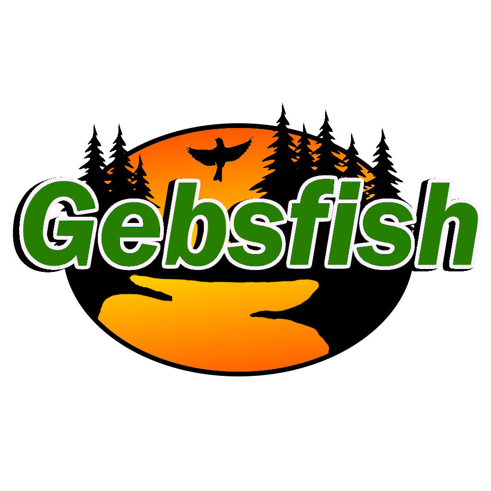

<h1 align="center">
  <br>
  
  <br>
  <a href="https://discord.gg/G8uSGZ8yyf" style="width:250"></a>
  <br>
</h1>

<h3 align="center">The Ultimate Fishing Expansion for DayZ</h3>

<p align="center">
  
  
  
  <a href="https://packjc.github.io/gebsfish/"></a>
</p>

<p align="center">
  <a href="https://packjc.github.io/gebsfish/">Website</a> •
  <a href="#key-features">Key Features</a> •
  <a href="#advanced-systems">Advanced Systems</a> •
  <a href="#configuration-examples">Configuration Examples</a> •
  <a href="#how-config-updates-work">Config Updates</a> •
  <a href="#credits">Credits</a> •
  <a href="#license">License & Terms</a> •
  <a href='CHANGELOG.md'>Change Log</a>
</p>

## Information

Gebsfish completely overhauls DayZ's fishing system into a deep, rewarding, and fully customizable experience.
Built from the ground up for modded servers, it adds dozens of new fish species, dynamic environmental systems, and powerful configuration tools for server owners.

## Requirements

* **[Community Framework (CF)](https://steamcommunity.com/sharedfiles/filedetails/?id=1559212036)** is a required mod — it must be loaded alongside Gebsfish on both server and client.

## Key Features

* **79 catchable yields** including fish, crustaceans, marine invertebrates, and amphibians.
* New tools, baits, lures, jigs, storage containers, and clothing.
* Fully featured logging system for dialing in your configs to your server's needs.
* Extensive config system allows complete customizability to fit your server:
  - Full configuration of fish (water type, rarity, fishing method, meat yield, behavior).
  - Full configuration of junk (rarity, item).
  - Full configuration of the ultra-rare treasure system (which containers spawn, what can be inside them, how rare it is, and what it costs your rod).
  - Full configuration of the bait/lure preference matrix (per-fish multipliers for every bait).
  - Full configuration of the predator spawn system (chance, classnames, spawn radius, warning sound, chat message).
  - Master enable toggles for every major catch-modifying system so you can run as much or as little of the mod as you want without losing your tuned values.
* Fully compatible with custom maps; if you have issues with the map you use working, make a ticket and we will issue a hotfix for that map if needed.
* Supported languages:
  - English
  - Czech
  - German
  - Russian
  - Polish
  - Hungarian
  - Italian
  - Spanish
  - French
  - Chinese (Traditional and Simplified)
  - Japanese
  - Portuguese
  > **Note**
  > Although supported languages are listed above, we cannot verify complete accuracy. If you are a native speaker and notice anything wrong, please reach out to us in the Discord via a ticket to assist us in getting proper translations.

## Advanced Systems

Gebsfish layers several configurable environmental systems on top of vanilla fishing. Each one can be toggled independently from the `$profile:Gebs/` config files — global toggles live in `general.json`, per-fish tuning in `fish.json`, and the bait matrix in `bait.json`.

* **Per-fish weather and time-of-day behavior** — every species has its own Rain, Storm, Dawn, Day, Dusk, and Night multipliers. Bass fire up at dawn and dusk, walleye and catfish wake up at night, trout chase the rain. Global multipliers stack with per-fish overrides and are capped by `MaxStackedMultiplier` so a stormy night never compounds into a runaway buff.

* **Moon phase system** — accurate synodic moon-phase calculation (Meeus algorithm) from the in-game date drives a small night-only catch buff. Full-moon nights bite up to **+20%**, new-moon nights up to **-10%**. Independent toggle in config; runs even if the rain/time-of-day buffs are disabled.

* **Water temperature simulation** — each species has `TempOptimal`, `TempMin`, and `TempMax` fields (in degrees Celsius). Bass and sunfish dominate hot summer days, trout and salmon take over in cold weather, tropical species stay active year-round in warm saltwater. A `WaterTempOffset` admin knob shifts the whole curve globally for cold-themed maps (e.g. Sakhal: `-5`, frozen lake roleplay: `-10`) or tropical mods (`+5`) without editing every fish.

* **Bite-speed cycle scaling** — every fish has a 24-hour `BiteSpeed` array tuned to its real-world circadian pattern. The catching system aggregates this across the active fish pool to drive how long you wait between bites, weighted by per-fish abundance and the current time-of-day multiplier. Catfish bite slow at noon; panfish bite slow at midnight.

* **Per-bait fish preference matrix** — 23 baits and lures each carry a per-fish multiplier table (the numbered lure variants share one entry per family, e.g. `geb_SpinnerBait` covers `geb_SpinnerBait1-4`). Worms catch bluegill 2× more readily than bass and ignore large saltwater fish. Spinnerbaits attract bass, spoons attract trout and pike, live minnows attract pike and walleye. Roughly 700 seeded bait/fish pairings — all overridable in JSON.

* **Bamboo fishing net** — craftable, repairable net with cargo storage. Catches minnows, frogs, and salamanders out of the box, and catches land directly in the net's cargo (4×4) with overflow falling at your feet. Configurable spawn table with per-environment filtering (pond vs. sea) and an independent find-chance roll.

* **Foraging for bait** — dig for worms (85% find chance per attempt) or bugs (65%) with dedicated actions, each rolling against its own weighted catch table (worms and grubs from digging worms; crickets, grasshoppers, grubs, and worms from digging bugs). Tools wear on misses too, and every completed dig trains soft skills.

* **Live bait that dies** — worms, crickets, grasshoppers, and grubs are *alive*, and live bait perishes roughly 90 minutes after you find it. Stashing it in a Worm Container, Bug Container, or a cooler pauses the clock — the dedicated containers are worth carrying. The artificial rubber worm never dies. The Bait Bucket does the same job for small aquatic catches: minnows, crayfish, shrimp, frogs, and salamanders stay fresh inside it.

* **Cooler & freezer system** — coolers in 12 colors actively chill their cargo toward **-5°C**, cold enough that food eventually freezes solid, and rot stops entirely inside. The flip side: a frozen fish can't be filleted — thaw it by fire or time before prepping. Coolers refuse to nest inside other coolers.

* **Caviar & specialty yields** — roe fish produce caviar alongside their fillets, with a configurable keep-chance (default 30% via `CaviarChance`): trout and salmon give Red Caviar, Lake Sturgeon gives Black Caviar, Northern Pike gives Yellow Caviar. Lobsters yield a tail plus claws instead of standard fillets.

* **Hook-from-fish recovery** — roughly 1 in 250 fillet actions recovers a damaged hook or lure "stuck in the fish." The pool of recoverable hooks, their weights, and the damage range they spawn at are all admin-configurable; the hook lands in your inventory, or at your feet if it's full.

* **Ultra-rare treasure catches** — an extremely rare roll on a successful catch pulls up a container full of loot instead of a fish. Two independent admin-defined pools: `TreasureContainers` decides what it arrives as (each with its own weight, health range, and item count) and `TreasureLoot` decides what goes inside (weight, health range, and a quantity range for stackables). Every item slot rolls the loot pool separately, so no two hauls are the same even from the same container. Default `Chance` is `0.0002` — about **1 in 5000 catches**, not casts. Treasure only bites on a **proper fishing rod** — the crafted improvised rod never rolls (`RequireRealRod`) — and hauling one up costs the rod a third of its max health, so **three treasures ruin a pristine rod** (`RodCatchesToRuin`, `0` for no wear). Seeded with plain vanilla classnames so it works out of the box, and designed to be replaced with whatever your server considers a prize. Disable with `TreasureSettings.Enable: 0`.

* **Wooden Fish Mount** — a craftable trophy plaque (1 Wooden Plank + 1 Metal Wire, with a Hacksaw on you) that hangs flat on any wall. The mounted trophy is the *actual fish you caught* — its weight and quality persist — and decay is paused entirely while it's on the plaque. Mounting is permanent by design: the fish can't be detached, and destroying the mount destroys the trophy with it rather than handing it back — so the plaque can't double as a never-rots fish locker. The plaque itself carries a 45-day untouched lifetime, the same tier as tents and barrels.

* **Jon boat** — a drivable flat-bottomed boat in five variants with its own damage zones, spark plug slot, and cargo. Two deck slots take any cooler or tackle box and display it sitting on the deck, so you can run two coolers, two boxes, or one of each.

* **Configurable junk catches** — rods and nets can pull junk instead of fish: a weighted table of items (wellies, pots, anything you add) with per-entry spawn-damage ranges, plus a separate table for container junk that spawns holding cargo. Fully tunable in `junk.json`.

* **Repairs with consequences** — fishing rods repair with the Fishing Rod Repair Kit and the bamboo net repairs with Netting, but repairs cap at **Worn** — no restoring gear to factory-fresh — and Ruined tools are gone for good.

* **Predator spawn system** — configurable predators spawn around the player when fishing, gutting a fish, missing a catch, or using the bamboo net. Each action has its own chance value so you can keep predators on for fishing without applying them to filleting. Land-only spawn search — no underwater wolves. Per-predator `MinCount`, `MaxCount`, `MinRadius`, and `MaxRadius`. Optional warning sound RPC to nearby players and a configurable chat warning to the triggering player with color options.

* **Geb fish knife buffs** — modded fish knives carry **+54% durability** (200 HP vs vanilla `HuntingKnife`'s 130) and fillet fish **10% faster** than vanilla. Speed bonus is configurable via `FishKnifeSpeedMultiplier`; durability sits between `KitchenKnife` and `KukriKnife` so it feels like a premium tool without dominating.

* **Trader compatibility** — fish quality defaults to `1.0` so popular trader mods (DayZ-Expansion-Market, TraderPlus, Dr. Jones, etc.) accept them at full value out of the box. Configurable if your trader scales by quality.

* **Admin logging** — every session writes a timestamped log to `$profile:Gebs/logs/`. `DebugLogs` has three levels: `0` off, `1` per-cast summaries (pool composition, bite-speed aggregate, weighted pick results), `2` elevated — full per-fish breakdown tables showing exactly why each fish was or wasn't favored this cast. Built for answering "why isn't fish X spawning" without guesswork. Logs older than 3 days are deleted automatically at startup so an unattended server doesn't accumulate one file per restart.

## Configuration Examples

All configuration options are located in the `Gebs` folder inside your server's profile folder. A few examples below.

**Fish entry — one object per species in the `Species` array of `fish.json`** (field docs live in the `SpeciesInfo` string at the top of the file):

```json
"Species": [
    {
        "Classname": "Mackerel",
        "RecipeShape": 0,
        "ResultMain": "MackerelFilletMeat",
        "ResultBonus": "",
        "MeatMin": 1,
        "MeatMax": 2,
        "Environment": 2,
        "CatchMethod": 3,
        "CatchProbability": 22,
        "RainMultiplier": 1.0,
        "StormMultiplier": 1.2,
        "DawnMultiplier": 1.1,
        "DayMultiplier": 1.0,
        "DuskMultiplier": 1.1,
        "NightMultiplier": 1.0,
        "TempOptimal": 18.0,
        "TempMin": 8.0,
        "TempMax": 24.0,
        "BiteSpeed": "0.85 0.85 0.85 0.85 0.9 0.95 1 1 0.95 0.9 0.9 0.9 0.9 0.9 0.9 0.9 0.95 1 1 0.95 0.95 0.9 0.9 0.85"
    }
]
```

> **Note**
> `BiteSpeed` is a single **space-separated string** of 24 hourly values (index 0 = 12AM), not a JSON array — DayZ's JSON loader crashes on nested float arrays, so keep the string format when editing.

**Weather + moon + temperature toggles (top-level):**

```json
"WeatherSettings": {
    "WeatherCatchBoostEnable": 1,
    "RainCatchMultiplier": 1.25,
    "StormCatchMultiplier": 1.5,
    "DawnCatchMultiplier": 1.10,
    "DayCatchMultiplier": 1.0,
    "DuskCatchMultiplier": 1.10,
    "NightCatchMultiplier": 1.15,
    "MaxStackedMultiplier": 2.0,
    "MoonPhaseEnable": 1,
    "FullMoonMultiplier": 1.20,
    "NewMoonMultiplier": 0.90,
    "TemperatureEffectEnable": 1,
    "MinTempMultiplier": 0.1,
    "MaxTempMultiplier": 0.1,
    "WaterTempOffset": 0.0,
    "BiteSpeedEnable": 1
}
```

**Bait preference entry:**

```json
{
    "BaitClassname": "Worm",
    "Preferences": [
        { "FishClassname": "geb_BlueGill", "Multiplier": 2.0 },
        { "FishClassname": "geb_LargeMouthBass", "Multiplier": 1.4 },
        { "FishClassname": "geb_GreatWhiteShark", "Multiplier": 0.3 }
    ]
}
```

**Treasure pools (in `general.json`):**

```json
"TreasureSettings": {
    "Enable": 1,
    "Chance": 0.0002,
    "Announce": 1,
    "RequireRealRod": 1,
    "RodCatchesToRuin": 3
},
"TreasureContainers": [
    { "Classname": "SeaChest", "Weight": 1.0, "MinHealthLevel": 1, "MaxHealthLevel": 3, "MinItems": 3, "MaxItems": 6 }
],
"TreasureLoot": [
    { "Classname": "Nail", "Weight": 5.0, "MinHealthLevel": 1, "MaxHealthLevel": 3, "MinQuantity": 5, "MaxQuantity": 30 },
    { "Classname": "Compass", "Weight": 1.0, "MinHealthLevel": 0, "MaxHealthLevel": 2 }
]
```

> **Note**
> `Chance` is per **successful catch**, not per cast. `0.0002` is roughly 1 in 5000 catches; `0.0005` is about 1 in 2000. Setting `Chance` to `0` disables the feature just as `Enable: 0` does. `RequireRealRod` restricts treasure to rods inheriting from `FishingRod` (the vanilla rod and the gebsfish colour variants) — the crafted `ImprovisedFishingRod` never rolls. `RodCatchesToRuin` is how many pulls ruin a pristine rod: each treasure removes `maxHealth / RodCatchesToRuin`, so the default `3` costs 50 of a stock rod's 150 HP per haul; `0` disables the wear.

## How Config Updates Work

Worth knowing before you hand-tune anything, because it decides which of your edits survive a mod update:

* Each of the four files carries its own `ConfigVersion`. A file is only rewritten when something actually changed — a fresh generation, a re-seeded section, or a version bump. An up-to-date file is left completely alone.
* **A version bump rewrites all four files**, even if only one gained anything. Your values are carried through untouched — the file is re-serialized from what was loaded, not regenerated from defaults. Timestamps changing on all four is expected, not data loss.
* **Your existing values are never overwritten.** Updates are strictly additive: default entries missing from a list get inserted, entries already there are left exactly as you set them.
* **Deleting an entry is not how you disable it.** A row you remove counts as missing and gets re-added on the next version bump. Set its weight, chance, or `CatchProbability` to `0` instead — that survives every update. A section you empty on purpose is respected; a section that's entirely absent gets re-seeded with working defaults.
* Upgrading from pre-3.3 sweeps the old layout (`fishingsettings.json`, `Fish/Logs/`, `extras/mpmissions/`) into `$profile:Gebs/gebs_oldfiles/` and removes the emptied folders. Nothing is migrated *from* the old monolithic config — it's archived so you can still read your old tuning.

**Disabling individual systems:**

Each major subsystem can be turned off independently — set the toggle to `0` and the per-fish/per-bait/per-hour values stay in JSON for tuning but have no in-game effect. The bait system's master toggle is `Enable` at the top of `bait.json`; the rest live in `general.json` under `WeatherSettings`:

In `bait.json` (top level):

```json
"Enable": 1
```

In `general.json`:

```json
"WeatherSettings": {
    "WeatherCatchBoostEnable": 1,
    "MoonPhaseEnable": 1,
    "TemperatureEffectEnable": 1,
    "BiteSpeedEnable": 1
}
```

## Credits

- Lothsun for features, updates, and helping the direction of this mod!
- My close friends for motivation during this project
- TunaBomber for helping update community files and supplying the excel sheet for traders
- NekoSensei and iiiii42 for helping with initial translation support
- Doriiiiija and Echo4343 for help with community files
- Gramps#4914 for code compatibility help in the early days of the mod
- DannyDoomno1 for help with the proper way to send config data to the client from the server
- NekoSensei and the team/players at the Le Murmure des Sans-Ames Server
- The DayZ community for reporting bugs and inspiration throughout the life of the mod
- [CadNav](https://cadnav.com) for models and textures of fish.
- [All About the Birds & Macaulay Library](https://www.allaboutbirds.org/guide/Common_Loon/sounds) For the loon call recording used in the mod.


## Support

If you like this project and think it has improved your server in any way, consider contributing! We are always looking for help with ideas, new models, and any monetary support that can help improve the mod. Open a ticket in the Discord to discuss how you can contribute.


<!-- ## You may also like...

- Future Use -->

## License

[Attribution-NonCommercial-NoDerivatives 4.0 International](https://github.com/PackJC/gebsfish/blob/master/LICENSE)

## Usage & Terms
This item is NOT authorized (strictly forbidden) for any of these conditions:
- posting on Steam, except under the Steam account Cole.
- hosting on any download server other than gebsfish current workshop download.
- hosting on any launcher for distribution other than gebsfish current workshop download.
- to be packaged in any form other than gebsfish current workshop download.
- to create derivative works.

## PERMISSION IS NOT GRANTED FOR THIS MOD TO BE INCLUDED IN A "SERVER PACK" or "MOD PACK" DO NOT EVEN ASK TO REPACK. NO. NOT ALLOWED.
Use a Collection if you want to include this mod on your server for your users.

## Monetization
You are hereby given monetization approval under the conditions that you follow the DayZ Server Monetization agreement and have obtained permission from Bohemia. Read more here https://www.bohemia.net/monetization

## Donations
We accept donations at https://www.paypal.com/paypalme/packjc every dollar counts and we greatly appreciate any contributions!

### Copyright © Smoky Mountain Software 2022-2026
