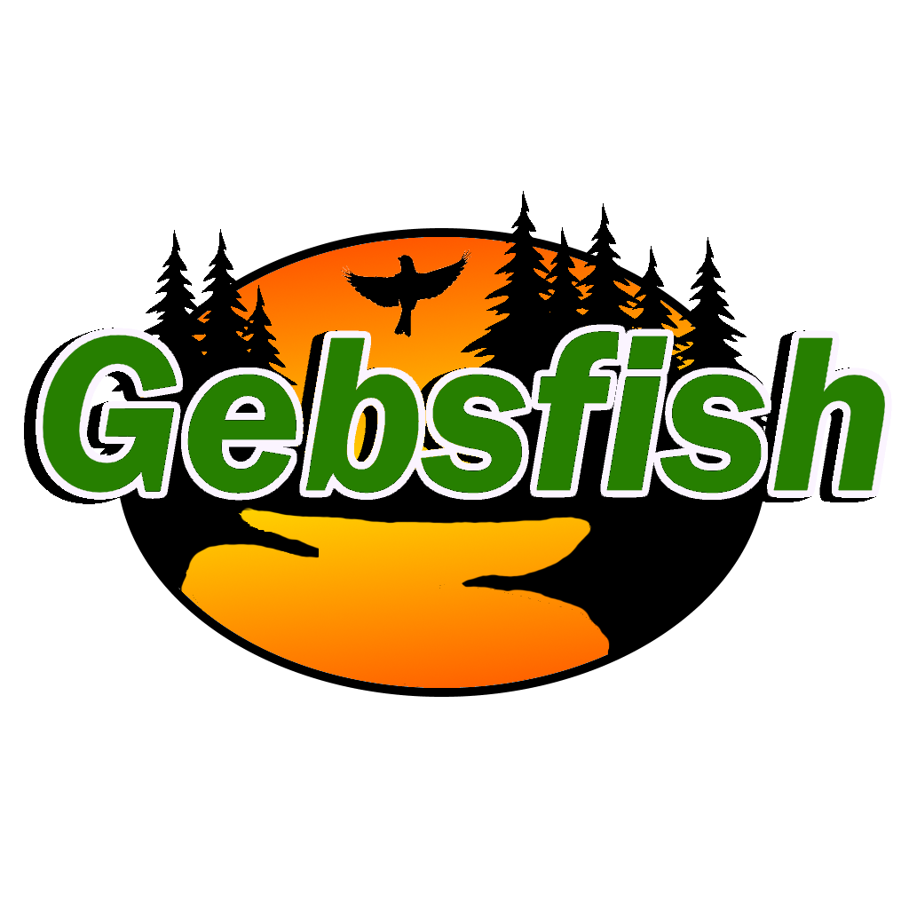

<h1 align="center">
  <br>
  
  <br>
  <a href="https://discord.gg/G8uSGZ8yyf" style="width:250"></a>
  <br>
</h1>

<h3 align="center">The Ultimate Fishing Expansion for DayZ</h3>

<p align="center">
  
  
  
  <a href="https://packjc.github.io/gebsfish/"></a>
</p>

<p align="center">
  <a href="https://packjc.github.io/gebsfish/">Website</a> •
  <a href="#key-features">Key Features</a> •
  <a href="#advanced-systems">Advanced Systems</a> •
  <a href="#configuration-examples">Configuration Examples</a> •
  <a href="#how-config-updates-work">Config Updates</a> •
  <a href="#credits">Credits</a> •
  <a href="#license">License & Terms</a> •
  <a href='CHANGELOG.md'>Change Log</a>
</p>

## Information

Gebsfish completely overhauls DayZ's fishing system into a deep, rewarding, and fully customizable experience.
Built from the ground up for modded servers, it adds dozens of new fish species, dynamic environmental systems, and powerful configuration tools for server owners.

## Requirements

* **[Community Framework (CF)](https://steamcommunity.com/sharedfiles/filedetails/?id=1559212036)** is a required mod — it must be loaded alongside Gebsfish on both server and client.

## Key Features

* **80 catchable yields** including fish, crustaceans, marine invertebrates, and amphibians.
* New tools, baits, lures, jigs, storage containers, and clothing.
* Fully featured logging system for dialing in your configs to your server's needs.
* Extensive config system allows complete customizability to fit your server:
  - Full configuration of fish (water type, rarity, fishing method, meat yield, behavior).
  - Full configuration of junk (how often it comes up, which items, how rare each one is).
  - Full configuration of the ultra-rare treasure system (which containers spawn, what can be inside them, how rare it is, and what it costs your rod).
  - Full configuration of the bait/lure preference matrix (per-fish multipliers for every bait).
  - Full configuration of the predator spawn system (chance, classnames, spawn radius, warning sound, chat message).
  - Master enable toggles for every major catch-modifying system so you can run as much or as little of the mod as you want without losing your tuned values.
* Works on custom maps: if a map's world data replaces the game's list of catches, the mod puts its own catches back once the map has set up, and keeps the map's extra catches. If your map still has problems, make a ticket and we will issue a hotfix for that map if needed.
* Supported languages:
  - English
  - Czech
  - German
  - Russian
  - Polish
  - Hungarian
  - Italian
  - Spanish
  - French
  - Chinese (Traditional and Simplified)
  - Japanese
  - Portuguese
  > **Note**
  > Although supported languages are listed above, we cannot verify complete accuracy. If you are a native speaker and notice anything wrong, please reach out to us in the Discord via a ticket to assist us in getting proper translations.

## Advanced Systems

Gebsfish layers several configurable environmental systems on top of vanilla fishing. Each one can be toggled independently from the `$profile:Gebs/` config files — global toggles live in `general.json`, per-fish tuning in `fish.json`, and the bait matrix in `bait.json`.

* **Per-fish weather and time-of-day behavior** — every species has its own Rain, Storm, Dawn, Day, Dusk, and Night multipliers. Bass fire up at dawn and dusk, walleye and catfish wake up at night, trout chase the rain. These per-fish values decide *which* fish takes the hook; the global multipliers in `WeatherSettings` decide *how often* anything bites. The two never multiply together, and each is capped by `MaxStackedMultiplier` so a stormy night never compounds into a runaway buff.

* **Moon phase system** — accurate synodic moon-phase calculation (Meeus algorithm) from the in-game date drives a small night-only catch buff. Full-moon nights bite up to **+20%**, new-moon nights up to **-10%**. Independent toggle in config; runs even if the rain/time-of-day buffs are disabled.

* **Water temperature simulation** — each species has `TempOptimal`, `TempMin`, and `TempMax` fields (in degrees Celsius). The water itself comes from the map's own world data — Chernarus lakes 15 °C and sea 23 °C, Livonia 20 / 25, Sakhal 2 / -0.5 — with a seasonal swing (lakes ±6 °C, the sea ±3 °C, warmest in early August). Bass and sunfish dominate summer lakes, trout and salmon take over in cold water, tropical species stay active in warm seas, and Sakhal fishes like an arctic map out of the box. A `WaterTempOffset` admin knob shifts the whole curve for custom maps or themed servers (frozen lake roleplay: `-10`, tropical: `+5`) without editing every fish.

* **Bite-speed cycle scaling** — every fish has a 24-hour `BiteSpeed` array tuned to its real-world circadian pattern. The catching system aggregates this across the active fish pool to drive how long you wait between bites, weighted by per-fish abundance and the current time-of-day multiplier. Catfish bite slow at noon; panfish bite slow at midnight.

* **Per-bait fish preference matrix** — 26 baits and lures each carry a per-fish multiplier table (the numbered lure variants share one entry per family, e.g. `geb_SpinnerBait` covers `geb_SpinnerBait1-4`). Worms favour bluegill and other panfish (×2.0) over bass (×1.4) and all but ignore large saltwater fish. In-line spinners attract bass, spoons attract trout and pike, live minnows attract pike and walleye, shrimp from sea traps go on the hook as the go-to bait for reef and tropical fish, and vanilla's trap fish are bait too: bitterlings for pike, walleye and bass, sardines for the big saltwater fish. Roughly 870 seeded bait/fish pairings — all overridable in JSON.

* **Bamboo fishing net** — craftable, repairable net with cargo storage. Catches minnows, frogs, and salamanders out of the box, and catches land directly in the net's cargo (4×4) with overflow falling at your feet. Configurable spawn table with per-environment filtering (pond vs. sea) and an independent find-chance roll.

* **Spear fishing** — hold an Improvised Spear (bone- or stone-tipped) and stab into shallow water (up to 1 m deep, within 3 m). No bait and a quick action, for the fish of the shallows: carp, panfish, bass, bowfin and bullfrogs in fresh water; flounder, grunts and blue tang at sea; mullet and gar in both. Its own catch table in `SpearFishingSettings`, with an on/off switch, a find chance, the maximum depth and a predator chance (rolled once per fish landed, as a rod rolls once per cast). Each stab wears the spear.

* **Foraging for bait** — dig for worms (each worm slot of the dig has an 85% find chance) or bugs (65% per dig) with dedicated actions, each rolling against its own weighted catch table (worms and grubs from digging worms; crickets, grasshoppers, grubs, and worms from digging bugs). A dug bug goes straight into the Bug Catcher (onto the spot you dug, if the catcher is full). Tools wear on misses too, and digging for bugs also trains soft skills.

* **Live bait that dies** — worms, crickets, grasshoppers, and grubs are *alive*, and live bait perishes roughly 90 minutes after you find it (at the server's normal food decay: like food rot it follows the server's FoodDecay setting, and 0 stops it). Stashing it in a Worm Container, Bug Catcher, or a cooler pauses the clock — the dedicated containers are worth carrying. The artificial rubber worm never spoils. The Bait Bucket does the same job for small aquatic catches: minnows, bitterlings, sardines, crayfish, shrimp, frogs, salamanders, clams, mussels, snails, starfish and jellyfish stay fresh inside it. A vanilla barrel at least half full of water keeps whole fish and minnows fresh too, like a live well, but not worms or insects. A ruined container preserves nothing.

* **Cooler & freezer system** — coolers in 11 colors actively chill their cargo toward **-5°C**, cold enough that food eventually freezes solid, and rot stops entirely inside. The flip side: a frozen fish can't be filleted — thaw it by fire or time before prepping. Coolers refuse to nest inside other coolers.

* **Caviar & specialty yields** — roe fish produce caviar alongside their fillets, with a configurable keep-chance (default 30% via `CaviarChance`): trout and salmon give Red Caviar, Lake Sturgeon gives Black Caviar, and Northern Pike and the muskellunges give Yellow Caviar. Lobsters yield a tail plus claws instead of standard fillets.

* **Hook-from-fish recovery** — roughly 1 in 250 fillet actions recovers a damaged hook or lure "stuck in the fish." The pool of recoverable hooks, their weights, and the damage range they spawn at are all admin-configurable; the hook drops on the ground beside you, with the fillets.

* **Ultra-rare treasure catches** — an extremely rare roll on a successful catch pulls up a container full of loot as well as the fish; the container lands at your feet. Two independent admin-defined pools: `TreasureContainers` decides what it arrives as (each with its own weight, health range, and item count) and `TreasureLoot` decides what goes inside (weight, health range, and a quantity range for stackables). Every item slot rolls the loot pool separately, so no two hauls are the same even from the same container. Default `Chance` is `0.0002` — about **1 in 5000 catches**, not casts. Treasure only bites on a **proper fishing rod** — the crafted improvised rod never rolls (`RequireRealRod`) — and hauling one up costs the rod a third of its max health, so **three treasures ruin a pristine rod** (`RodCatchesToRuin`, `0` for no wear). Seeded with plain vanilla classnames so it works out of the box, and designed to be replaced with whatever your server considers a prize. A treasure container nobody touches despawns after about two hours. Disable with `TreasureSettings.Enable: 0`.

* **Fish mounts in three sizes** — craftable trophy plaques (Planks + 1 Metal Wire, with a Hacksaw on you: 1 plank for the Small Fish Mount, 3 for the Medium, 6 for the Large) that hang flat on any wall. Which board a catch needs goes by the size of its model: the small one takes every bass and trout, perch and panfish, walleye and sauger, bowfin, chinook and cherry salmon, the Pacific bonito, yellowfin tuna and yellowtail snapper, mullet, rockfish, sculpin and minnows, vanilla's carp, mackerel, walleye pollock and steelhead trout, and the crayfish, lobsters, shrimp, shellfish, starfish, jellyfish, frogs and salamanders; the medium pike and the muskies, flathead catfish, alligator gar, northern snakehead, Pacific cod, great barracuda, sockeye salmon, southern flounder, largehead hairtail, the king and snow crab, and the reef and tropical fish (angelfish, blue tang, severum, redhead cichlid, Siamese tigerfish, humphead wrasse, white grunt); the large the lake sturgeon, blue marlin, sailfish, mahi-mahi and the sharks (great white, hammerhead, leopard and angel shark). Any board takes smaller catches too. Every species hangs side-on, head to the right, centred above the brass nameplate. The mounted trophy is the *actual fish you caught* — its weight and quality persist — and decay is paused entirely while it's on the plaque. Hang (or set down) the board first, then put the fish on it from the vicinity; a board you're carrying takes no fish. Mounting is permanent by design: the fish can't be detached, and destroying the mount destroys the trophy with it rather than handing it back — so the plaque can't double as a never-rots fish locker. The boards themselves carry a 45-day untouched lifetime, the same tier as tents and barrels. The large board is a heavy item, carried in both hands.

* **Jon boat** — a drivable flat-bottomed boat in five variants with its own damage zones, spark plug slot, and cargo. Two deck slots take any cooler or tackle box and display it sitting on the deck, so you can run two coolers, two boxes, or one of each. It spawns at the map's own boat spawn points next to the vanilla boats, one of each colour at most, through the generated `gebsfish-events.xml` (register it in `cfgeconomycore.xml`; its header shows how). The vanilla boats keep every spawn they had.

* **Fishing clothes** — fishing hats, shirts, raincoats, wellies and gloves in ten colours (red, green, blue, purple, orange, yellow, brown, light blue, lime and pink), carrying the Gebsfish logo; every shirt has a fish on its back, and the gloves are knit work gloves with a black rubber-dipped palm. Each colour is one shade across the whole mod, so a red hat matches a red rod, knife, cooler and tackle box. They give no fishing bonus, and the raincoats and wellies keep out the weather exactly as vanilla's do.

* **Configurable junk catches** — rods can pull junk instead of fish (nets and traps never do), about one catch in ten on every map and in every season by default (`JunkShare`): a weighted table of items (wellies, anything you add) with per-entry spawn-damage ranges, plus a separate table for liquid containers that come up empty (the default is a cooking pot). Fully tunable in `junk.json`.

* **Repairs with consequences** — fishing rods repair with the Fishing Rod Repair Kit and the bamboo net repairs with Netting, but repairs cap at **Worn** — no restoring gear to factory-fresh — and Ruined tools are gone for good.

* **Predator spawn system** — configurable predators spawn around the player when fishing, gutting a fish, missing a catch, using the bamboo net, or spear fishing. Each action has its own chance value so you can keep predators on for fishing without applying them to filleting. Land-only spawn search — no underwater wolves. Per-predator `MinCount`, `MaxCount`, `MinRadius`, and `MaxRadius`. Optional warning sound RPC to nearby players and a configurable chat warning to the triggering player with color options. Spawns are capped (at most 10 per event and 30 alive at once), and a predator still alive 15 minutes after spawning despawns once no player is within 150 m.

* **Geb fish knife buffs** — modded fish knives carry **+54% durability** (200 HP vs vanilla `HuntingKnife`'s 130) and fillet fish **10% faster** than vanilla. Speed bonus is configurable via `FishKnifeSpeedMultiplier`; at 200 HP it outlasts `KitchenKnife` (85), `HuntingKnife` (130) and `KukriKnife` (150) and matches the `Machete`, a premium tool for heavy filleting.

* **Trader compatibility** — `FishQuality` is how full each caught fish comes out (0–1; values above 1 act as 1), and with it how much the fish weighs. It defaults to `1.0`, a whole fish, because popular trader mods (DayZ-Expansion-Market, TraderPlus, Dr. Jones, etc.) refuse items that aren't full. Lower it (e.g. vanilla's `0.35`) only if your trader buys partly-full items.

* **Admin logging** — every session writes a timestamped log to `$profile:Gebs/logs/`. `DebugLogs` has three levels: `0` off, `1` per-cast summaries (the cast's time, rain and water temperature, the species in the pool, the bite-speed aggregate and which fish was picked), `2` elevated — adds per-fish tables (each species' abundance, environment and method masks, weather/temperature multiplier and bite speed) plus the bite-rate numbers on every tick. Built for answering "why isn't fish X spawning" without guesswork. Logs older than 3 days are deleted automatically at startup so an unattended server doesn't accumulate one file per restart.
* **Visual config editor** — open `docs/config-editor.html` (or the wiki's 🛠️ Config Editor), drop in your four JSON files, edit them with sliders, toggles and tables, and download them again. Everything stays in your browser. The **What will bite?** tab shows each species' odds for a map, date, hour, rain, water and bait, using your own files and the same maths as the server, so you can see what a change does before you restart.

## Configuration Examples

All configuration options are located in the `Gebs` folder inside your server's profile folder. A few examples below.

**Fish entry — one object per species in the `Species` array of `fish.json`** (field docs live in the `SpeciesInfo` string at the top of the file):

```json
"Species": [
    {
        "Classname": "Mackerel",
        "RecipeShape": 0,
        "ResultMain": "MackerelFilletMeat",
        "ResultBonus": "",
        "MeatMin": 1,
        "MeatMax": 2,
        "Environment": 2,
        "CatchMethod": 3,
        "CatchProbability": 22,
        "RainMultiplier": 1.0,
        "StormMultiplier": 1.2,
        "DawnMultiplier": 1.1,
        "DayMultiplier": 1.0,
        "DuskMultiplier": 1.1,
        "NightMultiplier": 1.0,
        "TempOptimal": 18.0,
        "TempMin": 8.0,
        "TempMax": 24.0,
        "BiteSpeed": "0.85 0.85 0.85 0.85 0.9 0.95 1 1 0.95 0.9 0.9 0.9 0.9 0.9 0.9 0.9 0.95 1 1 0.95 0.95 0.9 0.9 0.85"
    }
]
```

> **Note**
> `BiteSpeed` is a single **space-separated string** of 24 hourly values (index 0 = 12AM), not a JSON array. Keep the string format when editing: the mod reads the field as a string, and a list in its place won't load.

**Weather + moon + temperature toggles (top-level):**

```json
"WeatherSettings": {
    "WeatherCatchBoostEnable": 1,
    "RainCatchMultiplier": 1.25,
    "StormCatchMultiplier": 1.5,
    "DawnCatchMultiplier": 1.10,
    "DayCatchMultiplier": 1.0,
    "DuskCatchMultiplier": 1.10,
    "NightCatchMultiplier": 1.15,
    "MaxStackedMultiplier": 2.0,
    "MoonPhaseEnable": 1,
    "FullMoonMultiplier": 1.20,
    "NewMoonMultiplier": 0.90,
    "TemperatureEffectEnable": 1,
    "MinTempMultiplier": 0.1,
    "MaxTempMultiplier": 0.1,
    "WaterTempOffset": 0.0,
    "BiteSpeedEnable": 1
}
```

**Bait preference entry:**

```json
{
    "BaitClassname": "Worm",
    "Preferences": [
        { "FishClassname": "geb_BlueGill", "Multiplier": 2.0 },
        { "FishClassname": "geb_LargeMouthBass", "Multiplier": 1.4 },
        { "FishClassname": "geb_GreatWhiteShark", "Multiplier": 0.3 }
    ]
}
```

**Treasure pools (in `general.json`):**

```json
"TreasureSettings": {
    "Enable": 1,
    "Chance": 0.0002,
    "Announce": 1,
    "RequireRealRod": 1,
    "RodCatchesToRuin": 3
},
"TreasureContainers": [
    { "Classname": "SeaChest", "Weight": 1.0, "MinHealthLevel": 1, "MaxHealthLevel": 3, "MinItems": 3, "MaxItems": 6 }
],
"TreasureLoot": [
    { "Classname": "Nail", "Weight": 5.0, "MinHealthLevel": 1, "MaxHealthLevel": 3, "MinQuantity": 5, "MaxQuantity": 30 },
    { "Classname": "Compass", "Weight": 1.0, "MinHealthLevel": 0, "MaxHealthLevel": 2 }
]
```

> **Note**
> `Chance` is per **successful catch**, not per cast. `0.0002` is roughly 1 in 5000 catches; `0.0005` is about 1 in 2000. Setting `Chance` to `0` disables the feature just as `Enable: 0` does. `RequireRealRod` restricts treasure to rods inheriting from `FishingRod` (the vanilla rod and the gebsfish colour variants) — the crafted `ImprovisedFishingRod` never rolls. `RodCatchesToRuin` is how many pulls ruin a pristine rod: each treasure removes `maxHealth / RodCatchesToRuin`, so the default `3` costs 50 of a stock rod's 150 HP per haul; `0` disables the wear. A gebsfish container listed in `TreasureContainers` (a tackle box, cooler or bucket) only gets the loot it would accept.

## How Config Updates Work

Worth knowing before you hand-tune anything, because it decides which of your edits survive a mod update:

* Each of the four files carries its own `ConfigVersion`. A file is only rewritten when something actually changed — a fresh generation, a re-seeded section, or a version bump. An up-to-date file is left completely alone.
* **A version bump rewrites all four files**, even if only one gained anything. Your values are carried through untouched — the file is re-serialized from what was loaded, not regenerated from defaults. Timestamps changing on all four is expected, not data loss.
* **Your existing values are never overwritten.** Updates are strictly additive: default entries missing from a list get inserted, entries already there are left exactly as you set them.
* **Deleting an entry is not how you disable it.** A row you remove counts as missing and gets re-added on the next version bump. Set its weight, chance, or `CatchProbability` to `0` instead — that survives every update. A section you empty on purpose is respected, except `HookFromFishCatches`, `TreasureContainers` and `TreasureLoot`, which refill with the defaults when empty (set weights to `0` to switch them off); a section or list that's entirely absent (or `null`) gets re-seeded with working defaults, and so does a net, spear or dig section's missing `Catches` table.
* **A setting deleted from inside a section loads as `0`.** The game's loader builds each section of your file without its built-in defaults, so a single line you remove (a toggle, a chance) comes back off or zero. Settings the mod added in a later version (`CraftFishMount`, `RequireRealRod`, `RodCatchesToRuin`) are detected and given their defaults; for anything else, change the value instead of deleting the line.
* Upgrading from pre-3.3 sweeps the old layout (`fishingsettings.json`, `Fish/Logs/`, `extras/mpmissions/`) into `$profile:Gebs/gebs_oldfiles/` and removes the emptied folders. Nothing is migrated *from* the old monolithic config — it's archived so you can still read your old tuning.

**Updating from 3.3.2:**

* The four "Fun" tackle boxes are gone (they were the Yellow, Red, Purple and Green Tackle Box under a second name), and the bonito is now `geb_PacificBonito`. Old ones keep loading under the old names until your next wipe when they sit inside something (a tent, a container, a vehicle, a jon boat deck, an inventory, a cooler or a mount). One lying loose on the ground is gone after the second restart, with its contents, so move them into something before updating. Old bonito fillets don't carry over.
* Take `geb_FunYellowTackle`, `geb_FunRedTackle`, `geb_FunPurpleTackle`, `geb_FunGreenTackle`, `geb_Bonita` and `geb_BonitaFilletMeat` out of your mission's `types.xml` and any trader lists. The mod's generated files already name the new classes, and the old bonito rows in `fish.json` and `bait.json` are renamed on load, keeping your settings.

**Disabling individual systems:**

Each major subsystem can be turned off independently — set the toggle to `0` and the per-fish/per-bait/per-hour values stay in JSON for tuning but have no in-game effect. The bait system's master toggle is `Enable` at the top of `bait.json`; the rest live in `general.json` under `WeatherSettings`:

In `bait.json` (top level):

```json
"Enable": 1
```

In `general.json`:

```json
"WeatherSettings": {
    "WeatherCatchBoostEnable": 1,
    "MoonPhaseEnable": 1,
    "TemperatureEffectEnable": 1,
    "BiteSpeedEnable": 1
}
```

## Credits

- Lothsun for features, updates, and helping the direction of this mod!
- My close friends for motivation during this project
- TunaBomber for helping update community files and supplying the excel sheet for traders
- NekoSensei and iiiii42 for helping with initial translation support
- Doriiiiija and Echo4343 for help with community files
- Gramps#4914 for code compatibility help in the early days of the mod
- DannyDoomno1 for help with the proper way to send config data to the client from the server
- NekoSensei and the team/players at the Le Murmure des Sans-Ames Server
- The DayZ community for reporting bugs and inspiration throughout the life of the mod
- [CadNav](https://cadnav.com) for models and textures of fish.
- [All About the Birds & Macaulay Library](https://www.allaboutbirds.org/guide/Common_Loon/sounds) For the loon call recording used in the mod.


## Support

If you like this project and think it has improved your server in any way, consider contributing! We are always looking for help with ideas, new models, and any monetary support that can help improve the mod. Open a ticket in the Discord to discuss how you can contribute.


<!-- ## You may also like...

- Future Use -->

## License

[Attribution-NonCommercial-NoDerivatives 4.0 International](https://github.com/PackJC/gebsfish/blob/master/LICENSE)

## Usage & Terms
This item is NOT authorized (strictly forbidden) for any of these conditions:
- posting on Steam, except under the Steam account Cole.
- hosting on any download server other than gebsfish current workshop download.
- hosting on any launcher for distribution other than gebsfish current workshop download.
- to be packaged in any form other than gebsfish current workshop download.
- to create derivative works.

## PERMISSION IS NOT GRANTED FOR THIS MOD TO BE INCLUDED IN A "SERVER PACK" or "MOD PACK" DO NOT EVEN ASK TO REPACK. NO. NOT ALLOWED.
Use a Collection if you want to include this mod on your server for your users.

## Monetization
You are hereby given monetization approval under the conditions that you follow the DayZ Server Monetization agreement and have obtained permission from Bohemia. Read more here https://www.bohemia.net/monetization

## Donations
We accept donations at https://www.paypal.com/paypalme/packjc every dollar counts and we greatly appreciate any contributions!

### Copyright © Smoky Mountain Software 2022-2026
